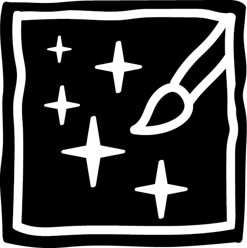

# Astral.Canvas
Astral Canvas is a collection of libraries and frameworks for writing graphical apps using C++ and Vulkan, with a C interface and Metal support coming soon. It can be seen as a port/further development of [Somnium.Framework](https://github.com/Linx145/Somnium/tree/master), and will succeed it in the near future. It uses GLFW as a backend for windowing and input.

## Building
The project is currently being developed and tested on Windows with MSVC. After cloning the repository, cd into it and run `premake5 <target>`. 

The project needs several dynamic libraries to compile, primarily spirv-cross libraries, which must be inserted into the respective OS folders in `Astral.Canvas/Astral.Shaderc/dependencies`

An example for rendering a sprite which can be moved around with the WASD keys can be found in the Test folder.

## Notes
Although it utilises namespaces, class methods and templated types, Astral.Canvas does not use many C++ features such as exceptions and inheritance, doing things the C way instead. It also relies on it's own standard library, which may be a put off for some wanting to integrate it into their project. The rationale for this is to create a sane ABI

Other projects under the repository include:
* Astral.Core: Astral.Canvas' standard library
* Astral.Reflect: A C-style language tokenizer and (in the future) reflector
* Astral.Shaderc: Wraps glslang and spirv-cross to allow parsing Astral.Canvas shader files, an example of which can be seen in the Test folder
* Astral.Json: Json tokenizer and parser, inspired by System.Text.Json